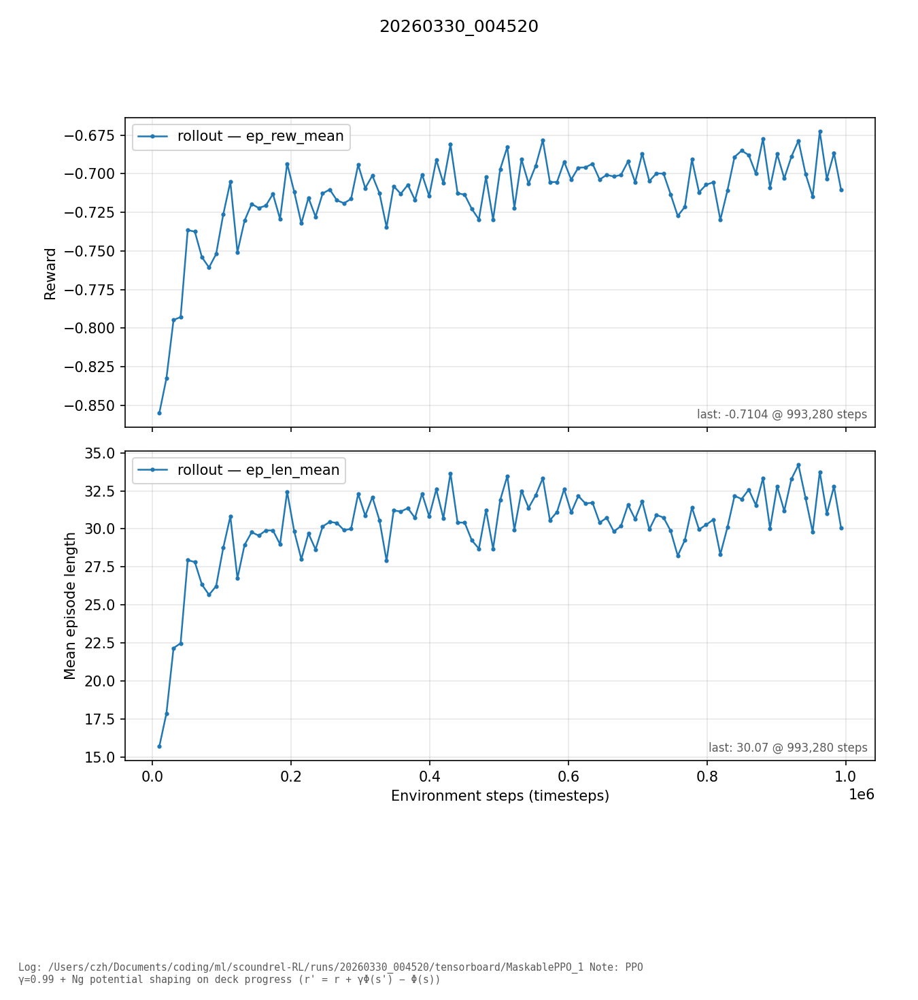

# scoundrel-rl

Scoundrel card game engine, Gymnasium environment, pygame viewer, Maskable PPO training experiments

## Installation

`**setup_env.sh**` is for Unix-like systems (Linux, macOS). It creates a Python **venv** in `.venv/`, upgrades `pip`, and installs **scoundrel-rl** in editable mode with the `dev`, `gui`, `rl`, and `analysis` extras (tests, pygame viewer, Stable-Baselines3, plotting).

GPU acceleration for training depends on how you install **PyTorch** (optional); the default stack runs on CPU.

```bash
git clone https://github.com/<you>/scoundrel-rl.git
cd scoundrel-rl
bash setup_env.sh
source .venv/bin/activate
```

Manual install without the script:

```bash
python3 -m venv .venv
source .venv/bin/activate
pip install -U pip
pip install -e ".[dev,gui,rl,analysis]"
```

Minimal install (engine + tests only):

```bash
pip install -e .
pip install -e ".[dev]"
```

## Quick start

Workflow overview:

1. Install the package (see above).
2. Run the **viewer** to play the game in a window (requires `gui`).
3. Use `**ScoundrelEnv`** from Python for Gymnasium-style `reset` / `step` with **action masks**.
4. **Train** with Maskable PPO and log **TensorBoard** metrics under `runs/<timestamp>/`.
5. **Plot** rollout metrics from the TensorBoard logs (`analysis/plot_run.py`), or open TensorBoard.

## Results (example run)

Example **rollout** curves from a Maskable PPO training run (`runs/20260330_004520`): **mean episode return** and **mean episode length** vs environment steps. Training used **Ng potential-based shaping** on deck progress with γ aligned to PPO. On comparable setups, policies can reach **on the order of ~30% win rate** on random shuffles (not all deck orders are winnable, good chance there is room for improvement however)



## Examples

**Tests** (from repo root):

```bash
python -m pytest
```

**Retro pygame viewer** (play Scoundrel):

```bash
scoundrel-viewer
# or: python -m viewer
```

**Train Maskable PPO** (writes `runs/<timestamp>/` with TensorBoard logs and checkpoints):

```bash
PYTHONPATH=. python -m scoundrel.train
```

**TensorBoard** (interactive curves):

```bash
tensorboard --logdir runs/<timestamp>/tensorboard
```

**Plot rollout metrics** (`rollout/ep_rew_mean`, `rollout/ep_len_mean`) to a PNG:

```bash
PYTHONPATH=. python analysis/plot_run.py
PYTHONPATH=. python analysis/plot_run.py --logdir runs/<timestamp>/tensorboard/MaskablePPO_1 -o analysis/figures/run.png
```

With no `--logdir`, `plot_run.py` picks the newest TensorBoard event file under `./runs` and writes `analysis/figures/<run_name>.png` by default.

## Project layout


| Path         | Purpose                                 |
| ------------ | --------------------------------------- |
| `scoundrel/` | Engine, `ScoundrelEnv`, `train.py`      |
| `viewer/`    | Pygame UI                               |
| `tests/`     | Pytest suite                            |
| `analysis/`  | `plot_run.py` for TensorBoard → figures |
| `runs/`      | Training outputs (gitignored)           |


