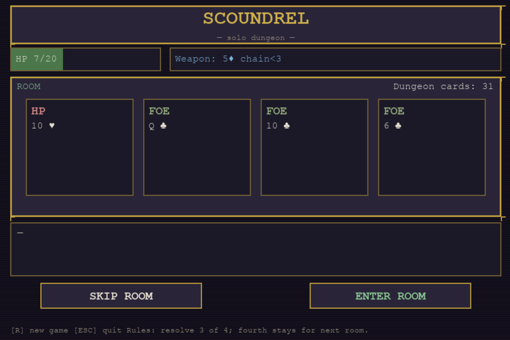
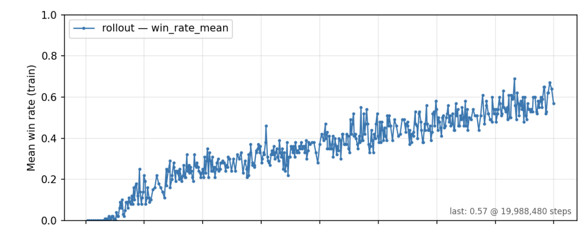

# scoundrel-rl

Scoundrel card game engine, Gymnasium environment, pygame viewer, Maskable PPO training experiments



## Installation

`**setup_env.sh**` is for Unix-like systems (Linux, macOS). It creates a Python **venv** in `.venv/`, upgrades `pip`, and installs **scoundrel-rl** in editable mode with the `dev`, `gui`, `rl`, and `analysis` extras (tests, pygame viewer, Stable-Baselines3, plotting).

GPU acceleration for training depends on how you install **PyTorch** (optional); the default stack runs on CPU.

```bash
git clone https://github.com/<you>/scoundrel-rl.git
cd scoundrel-rl
bash setup_env.sh
source .venv/bin/activate
```

Manual install without the script:

```bash
python3 -m venv .venv
source .venv/bin/activate
pip install -U pip
pip install -e ".[dev,gui,rl,analysis]"
```

Minimal install (engine + tests only):

```bash
pip install -e .
pip install -e ".[dev]"
```

## Quick start

Workflow overview:

1. Install the package (see above).
2. Run the **viewer** to play the game in a window (requires `gui`).
3. Use `**ScoundrelEnv`** from Python for Gymnasium-style `reset` / `step` with **action masks**.
4. **Train** with Maskable PPO and log **TensorBoard** metrics under `runs/<timestamp>/` (training **win rate**, **deck stats**, eval reward).
5. **Plot** rollout metrics (`analysis/figures/<run>.png` is written automatically after training if `analysis` extras are installed; use `analysis/plot_run.py` to regenerate), **replay** the policy with `python -m scoundrel.replay_best_gui runs/<timestamp>/` (command is printed after training), or open TensorBoard.

## Results (example run)

Example **TensorBoard-style** view of a Maskable PPO training run: **mean episode return** (auto-scaled y-axis), **mean episode length**, **rolling training win rate**, and **deck / in-play monster stats** (mean monster rank-sum still in the draw pile at episode end, and mean monster **count** in deck+hand — the latter tracks progress aligned with potential shaping). Training uses **dense shaping** unless disabled: per-room HP loss penalty, **Ng-style potential** on monster progress in deck+hand (γ matched to PPO), bonus when monster power leaves the draw pile, optional **room-survived** bonus, and optional penalties for **wasted potions** and **overheal** (weapon-downgrade penalty is configurable and often off). Policies on random shuffles can reach **on the order of tens of percent** training win rate depending on settings; not all deck orders are winnable.



## Examples

**Tests** (from repo root):

```bash
python -m pytest
```

**Retro pygame viewer** (play Scoundrel):

```bash
scoundrel-viewer
# or: python -m viewer
```

**Train Maskable PPO** (writes `runs/<timestamp>/` with TensorBoard logs and checkpoints; on success also writes `analysis/figures/<run_name>.png` when the `analysis` extra is installed; prints commands to regenerate the plot and to open the **replay GUI**):

```bash
PYTHONPATH=. python -m scoundrel.train
```

**TensorBoard** (interactive curves):

```bash
tensorboard --logdir runs/<timestamp>/tensorboard
```

**Plot rollout metrics** (same figure as the post-training step, or regenerate for any run):

```bash
PYTHONPATH=. python analysis/plot_run.py
PYTHONPATH=. python analysis/plot_run.py --logdir runs/<timestamp>/tensorboard/MaskablePPO_1 -o analysis/figures/run.png
```

With no `--logdir`, `plot_run.py` picks the newest TensorBoard event file under `./runs` and writes `analysis/figures/<run_name>.png` by default.

## Project layout


| Path         | Purpose                                                                 |
| ------------ | ----------------------------------------------------------------------- |
| `scoundrel/` | Engine, `ScoundrelEnv`, `train.py`, TensorBoard callbacks (win / deck) |
| `viewer/`    | Pygame UI                                                             |
| `tests/`     | Pytest suite                                                          |
| `analysis/`  | `plot_run.py` for TensorBoard → figures                               |
| `docs/images/` | Screenshots for this README                                         |
| `runs/`      | Training outputs (gitignored)                                         |

